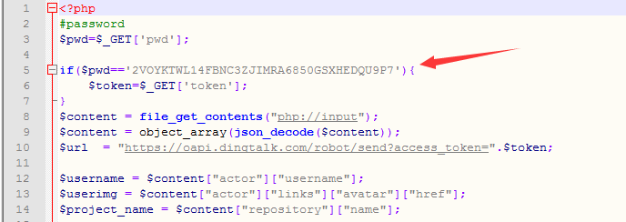
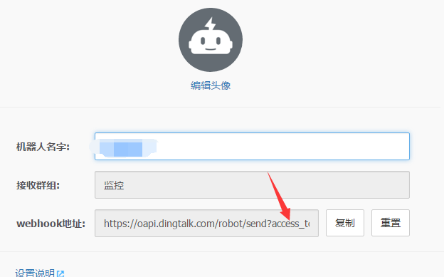
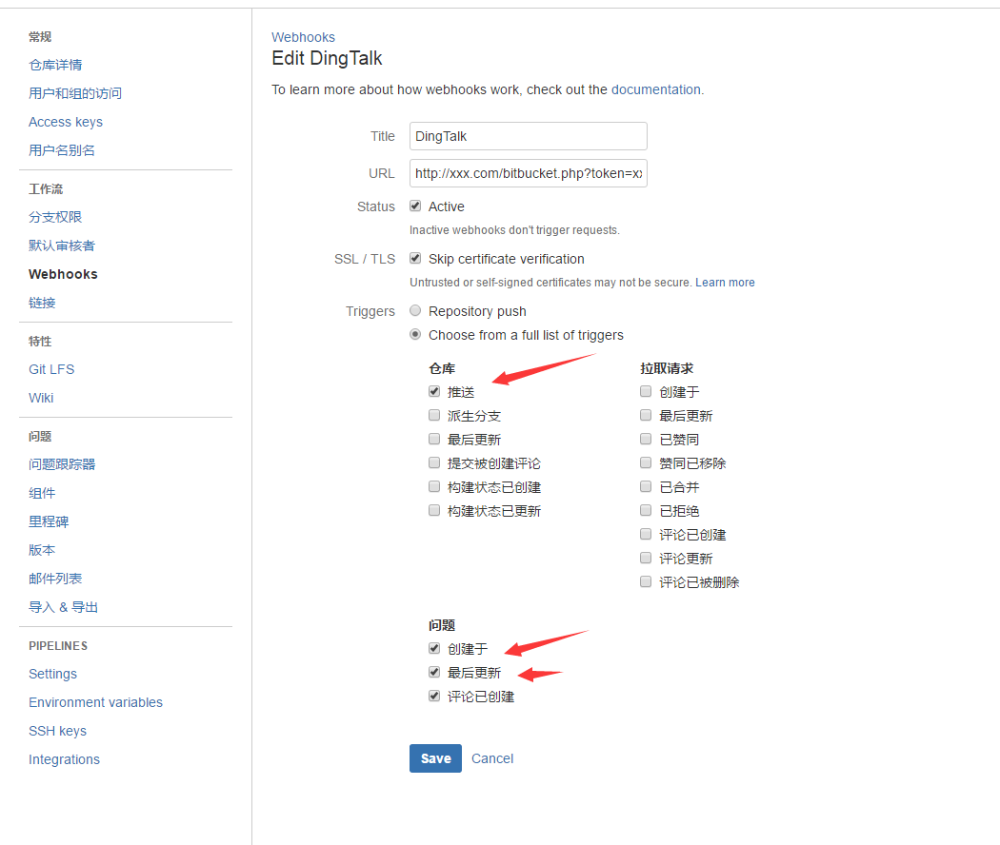
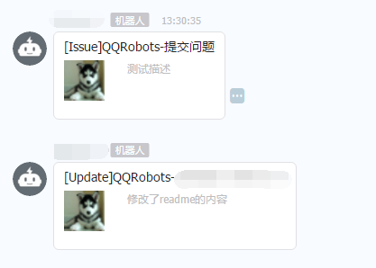

# bitbucket-to-dingtalk

bitbucket push代码、提交issue 提醒 到钉钉

 1. 把文件放到一个Php环境中，获取地址为:xxx.com/bitbucket.php
 2. 设置操作密码，如图所示：

3.在钉钉上面生成一个机器人接口，并复制access_token:

4.最后构造好url，如下：http://xxx.com/bitbucket.php?token=xxxx&pwd=xxxx
5.在bitbucket设置下Webhooks即可，如图所示：

6.效果，如图所示：
